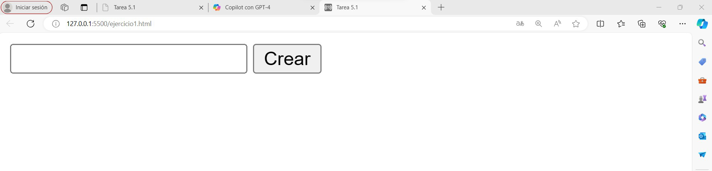
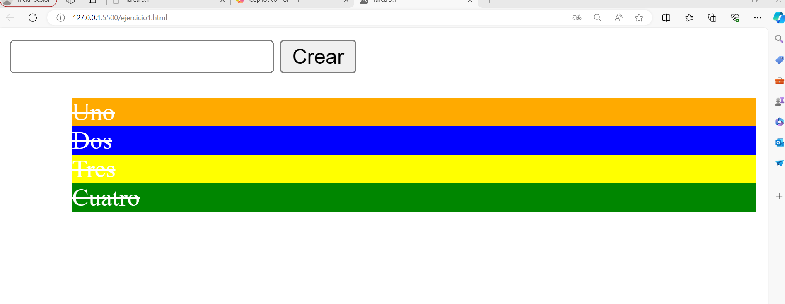
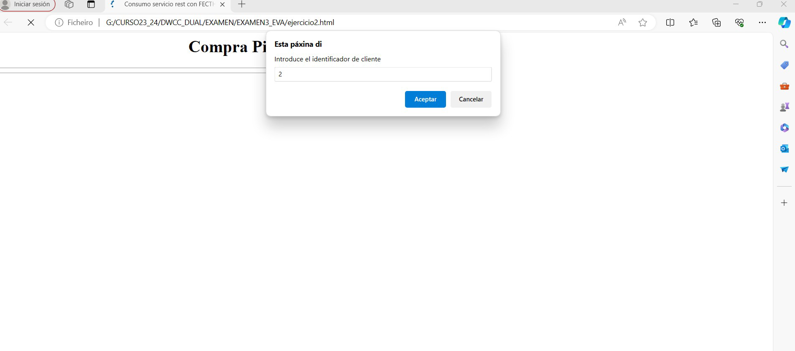
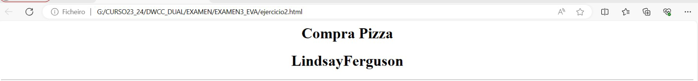
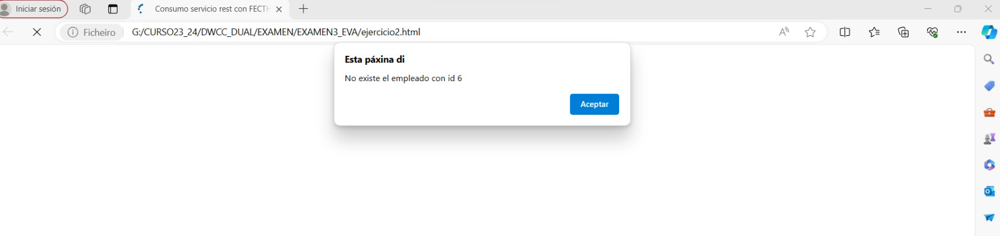
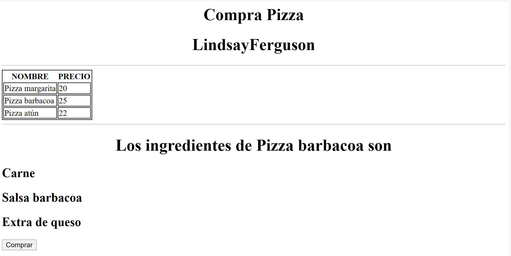
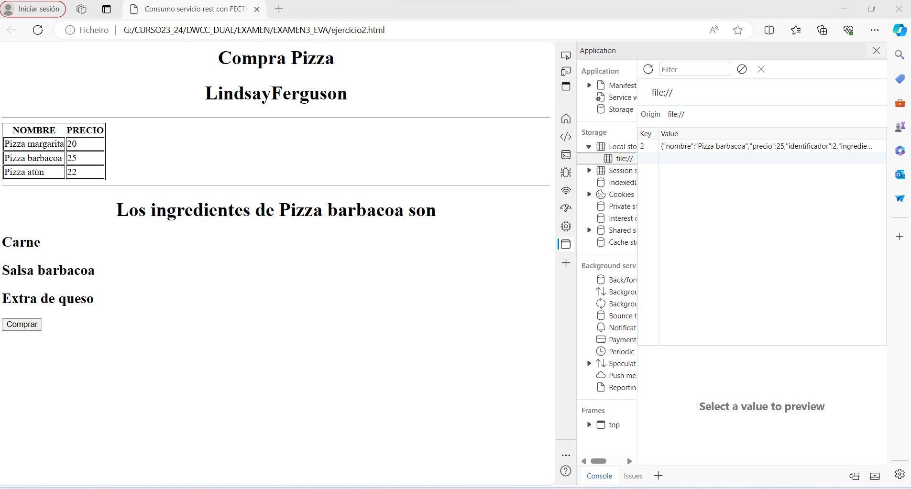

# ExamenCliente

1. Ejercicio 1: Crea un programa JavaScript que se ejecute en el navegador que muestre el el
siguiente aspecto y funcionalidad (4 puntos)
Funcionamiento:

▪ Apartado 1: El usuario introduce un valor en el cuadro de texto. Al pulsar el botón crear
comprueba si es numérico. En caso de que no lo sea crea una nueva viñeta con el
contenido. Si el valor es numérico muestra un alert. En cualquiera de los dos casos se debe
limpiar el cuadro de texto y asignar el foco.

▪ Apartado 2: Al pulsar el botón derecho sobre cada elemento de la lista modifica el aspecto.
El color de fondo se debe generar a través de una función de forma aleatoria

▪ Apartado 3: Al hacer clic sobre cada elemento de la lista, lo elimina

▪ Apartado 4: Funcionalidad con delegación de eventos, funciones, sintaxis flecha,
declaración de variables

▪ Apartado 1: (1 punto)
▪ Apartado 2: (1 punto)
▪ Apartado 3: (1 punto)
▪ Apartado 4: (1 punto)

2. Ejercicio 2: Crea un programa JavaScript que se ejecute en el navegador que muestre el el
siguiente aspecto y funcionalidad (6 puntos)
◦ Funcionamiento:
▪ Apartado 1: El usuario introduce un identificador de cliente con prompt.

▪ Recorre el array de clientes. Si lo encuentra muestra el nombre creando un nodo de tipo H1,
con su nombre. Debes crear una función para mostrar los datos del cliente.

▪ En caso de que no lo encuentre muestra un alert.

▪ Apartado 2: Recorrer el array de artículos y mostrar los datos en formato tabla. Debe
resolverse en una función. Los nodos (table, td, tr), deben crearse utilizando los métodos
específicos de la estructura DOM.

▪ Apartado 3: Utilizando el mismo identificador del cliente, busca la pizza cuyo identificador
sea igual al identificador del cliente. Si lo encuentra muestra los ingredientes de la pizza,
creando la estructura de nodos para que tenga el siguiente aspecto.

▪ Apartado 4: Crear botón Comprar.

▪ Apartado 5: Al pulsar el botón Comprar, almacena en el LocalStorage.

▪ Apartado 6: Utilizar find, funciones flecha, o/y map, declaración correcta de variables, etc.

▪ Apartado 7: Al cargar los ingredientes de la pizza que el resultado se muestre transcurrido
unos segundos.

◦ Valoración:
▪ Apartado 1: (1 punto)
▪ Apartado 2: (1 punto)
▪ Apartado 3: (1 punto)
▪ Apartado 4: (0,75 puntos)
▪ Apartado 5: (0,75 puntos)
▪ Apartado 6: (1 punto)
▪ Apartado 7: (0,5 puntos)
